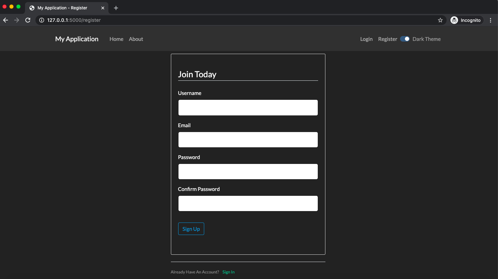

Boiler-plate for FLASK

**Features**

- Bootstrap4
- Bootswatch themes with switch to toggle between light and dark theme
- Basic Authentication with user sign-up, login, password reset etc
- LDAP support
- Flask Migrate for migrations
- Redis Queue, RQ Worker and RQ-Dashboard integrated
- Email sent as background tasks using Redis Queue and RQ worker

Dependencies :-

Background task (password reset) is based on background tasks. This is implemented using Redis Queue and RQ worker.
You need to run Redis Server and RQ worker as separate process to utilize this functionality.
RQ-Dashboard is integrated into the app and can be accessed at 127.0.0.1:5000/rq

**Setup**

`git clone https://github.com/sarbjit87/flask_boilerplate.git`

`pip install -r requirements.txt`

`export FLASK_APP=app`

`flask db init`

`flask db migrate`

`flask db upgrade`

`python3 run.py`

**Screenshot**

**DISCLAIMER**

THE CODE IS BEING PROVIDED FOR INFORMATIONAL PURPOSES ONLY.

USE ON YOUR OWN RISK. THIS SOFTWARE IS PROVIDED BY THE COPYRIGHT HOLDER OR CONTRIBUTORS "AS IS" AND ANY EXPRESS OR IMPLIED WARRANTIES, INCLUDING, BUT NOT LIMITED TO, THE IMPLIED WARRANTIES OF MERCHANTABILITY AND FITNESS FOR A PARTICULAR PURPOSE ARE DISCLAIMED. IN NO EVENT SHALL THE COPYRIGHT HOLDER OR CONTRIBUTORS BE LIABLE FOR ANY DIRECT, INDIRECT, INCIDENTAL, SPECIAL, EXEMPLARY, OR CONSEQUENTIAL DAMAGES

THIS REPO IS RELEASED WITH NO WARRANTY AT ALL.
